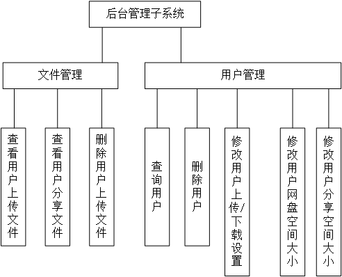
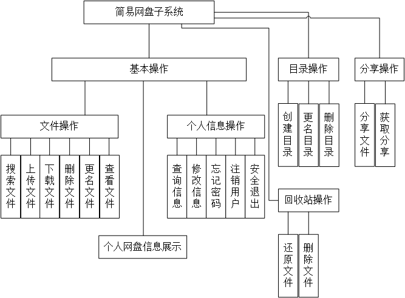

# 一、系统设计

## 1.1 系统功能需求

### 1.1.1 后台管理子系统

后台管理子系统要求管理员登陆成功后，才能对网盘文件进行管理，包括查看用户上传文件，查看用户分享文件，删除用户上传文件。除文件管理外，管理员还需要对注册用户、用户网盘空间大小、用户分享空间大小、用户上传下载设置（一次性上传、下载文件的大小）进行管理。

### 1.1.2 简易网盘子系统

非注册用户需要注册之后才能使用系统功能。成功登录的用户具有上传文件、下载文件、删除文件、更名文件、分享文件、创建目录、更名目录、删除目录、查看用户个人信息的功能。

## 1.2 系统模块划分

### 1.2.1 后台管理子系统

功能说明如下图所示

### 1.2.2 简易网盘子系统

功能说明如下图所示

