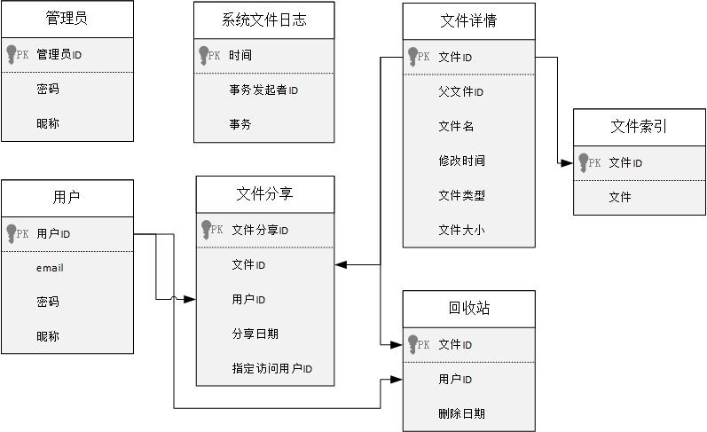

## 第二章 数据库设计

系统采用加载纯Java数据库驱动程序的方式链接MySQL
8.0数据库。在数据库中创建数据库networkdisk，并在networkdisk中创建admintable、usertable、fileindextable、filedetailtable、filesharetable、recyclebintable、systemfilelogtable。

### 2.1 数据库概念结构设计

根据系统设计和分析，可以设计出如下数据结构。

**1.** **管理员**

管理员包括管理员ID、密码、呢称。管理员ID由三位数字ID组成，从001开始，最多999位管理员。管理员的用户名和密码由数据库管理员预设，不需要注册。

**2.** **用户**

用户包括用户ID、邮箱email、密码、昵称。注册用户的邮箱email不能一样。用户ID由系统随机生成11位数字，具有唯一性。密码由6位及以上的字母或数字组成，由用户自己设置。昵称可以由用户自己设置，默认为“昵称”。

**3.** **系统文件日志**

系统文件日志包括时间、事务发起者ID、事务。事务发起者可以是用户、管理员，事务发起者ID就是用户、管理员的ID。

**4.** **文件分享**

文件分享包括文件分享ID、文件ID、用户ID、分享日期、指定访问用户ID。其中，文件分享ID由11位随机小写字母组成，具有唯一性。用户ID与“2.用户”关联，文件ID与“5.文件详情”关联。到期时间以日为最小单位，当日23:
59后文件过期。指定访问用户ID由文件所有者设置，如果设置，必须为有效用户ID。

**5.** **文件详情**

文件详情包括文件ID、父文件ID、文件名、修改时间、文件类型、文件大小。文件ID由11位随机小写字母和数字组成，具有唯一性。如果没有父文件，父文件ID为用户ID。文件名由用户设置。修改时间是文件最后的修改时间。文件如果是目录，文件大小为目录下所有文件大小的总和。

**6.** **文件索引**

文件索引包括文件ID、具体文件。文件ID与“5.文件详情”关联。

**7.** **回收站**

回收站包括文件ID、用户ID、删除日期。文件ID与“5.文件详情”关联。用户ID与“2.用户”关联。过期时间为删除文件后7天的23:59。

根据以上的数据结构，结合数据库设计的特点，可以画出如下图所示的数据库概念结构图。

### 2.2 数据库逻辑结构设计

将数据库概念结构图转换为MySQL数据库所支持的实际数据模型，即数据库的逻辑结构。

管理员信息表（admintable）的设计如下表所示。

| 字段   | 含义        | 类型      | 长度  | 是否为空 |
|------|-----------|---------|-----|------|
| id   | 管理员ID（PK） | varchar | 3   | no   |
| name | 昵称        | varchar | 50  | no   |
| pwd  | 密码        | varchar | 50  | no   |

用户信息表（usertable）的设计如下表所示。

| 字段    | 含义       | 类型      | 长度  | 是否为空 |
|-------|----------|---------|-----|------|
| id    | 用户ID（PK） | varchar | 11  | no   |
| email | 邮箱       | varchar | 50  | no   |
| pwd   | 密码       | varchar | 50  | no   |
| name  | 昵称       | varchar | 50  | no   |

系统日志信息表（systemfilelogtable）设计如下表所示。

| 字段    | 含义      | 类型       | 长度  | 是否为空 |
|-------|---------|----------|-----|------|
| time  | 时间（PK）  | datetime |     | no   |
| id    | 事务发起者ID | varchar  | 11  | no   |
| event | 事务      | varchar  | 50  | no   |

文件分享信息表（filesharetable）的设计如下表所示。

| 字段       | 含义         | 类型       | 长度  | 是否为空 |
|----------|------------|----------|-----|------|
| shareid  | 文件分享ID（PK） | varchar  | 11  | no   |
| fileid   | 文件ID       | varchar  | 11  | no   |
| userid   | 用户ID       | varchar  | 11  | no   |
| time     | 分享时间       | datetime |     | no   |
| accessid | 指定访问用户ID   | varchar  | 50  |      |

文件详情信息表（filedetailtable）的设计如下表所示。

| 字段       | 含义       | 类型         | 长度  | 是否为空 |
|----------|----------|------------|-----|:-----|
| fileid   | 文件ID（PK） | varchar    | 11  | no   |
| parentid | 父文件ID    | varchar    | 11  | no   |
| name     | 文件名      | varchar    | 50  | no   |
| time     | 修改时间     | datetime   |     | no   |
| style    | 文件类型     | varchar    | 50  | no   |
| size     | 文件大小     | varchar    | 50  | no   |
| file     | 文件       | Mediumblob |     | no   |

文件详情信息表（fileindextable）的设计如下表所示。

| 字段   | 含义       | 类型      | 长度  | 是否为空 |
|------|----------|---------|-----|:-----|
| id   | 文件ID（PK） | varchar | 11  | no   |
| file | 父文件ID    | varchar | 11  | no   |

回收站信息表（recyclebintable）的设计如下表所示。

| 字段     | 含义       | 类型       | 长度  | 是否为空 |
|--------|----------|----------|-----|------|
| fileid | 文件ID（PK） | varchar  | 11  | no   |
| userid | 用户ID     | varchar  | 11  | no   |
| time   | 删除日期     | datetime |     | no   |

### 2.3 创建数据表

根据2.2节中的逻辑结构，创建数据表。创建数据表的代码在[networkdisk/mysql.sql](../mysql.sql)文件里。